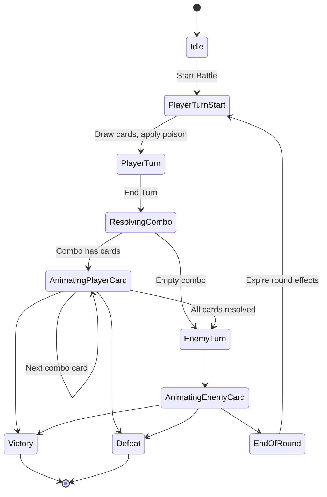

# Dark Fantasy Card Game — Mechanics

This document describes the game rules implemented today and the planned direction for the full game.

## Scope

**Implemented now:** turn-based card battles between the player and an enemy.

**Planned later:** a global map where the player chooses locations to visit or enemies to fight, earns experience from those encounters, and spends experience to unlock new cards and customize their deck.

Battles are the combat layer of the larger game. Map navigation, progression, economy, and deck building outside of combat are not implemented yet.

---

## Core Concept: Health Is Your Deck

There are no separate hit points. **Remaining cards represent health.**

| Combatant | Health formula |
|-----------|----------------|
| Player | cards in **deck** + **hand** + **combo** |
| Enemy | cards in **deck** only |

When a combatant takes damage, they lose that many cards from their deck (or other zones for the player). When health reaches zero, that combatant loses the battle.

- **Player defeat:** no cards left in deck, hand, or combo.
- **Victory:** enemy deck is empty.

Max health is recorded at battle start from the initial deck size.

---

## Battle Flow

A battle is a repeating cycle of **player turn → combo resolution → enemy turn → end of round**.

### Player turn start

At the beginning of each player turn:

1. **Poison ticks** on the player, then on the enemy (see [Poison](#poison)).
2. Victory/defeat is checked after poison.
3. **Cards are drawn:**
   - First turn of the battle: **4** cards (configurable).
   - Every later turn: **1** card.

The player deck does **not** reshuffle from discard when empty. If the deck is empty, no more cards are drawn.

### Player turn

During the player turn the player can:

- Move cards from **hand** into the **combo** (click a hand card).
- Move cards from **combo** back to **hand** (click a combo card).
- Review the **combo preview** (see [Combo Preview](#combo-preview)).
- Press **End Turn** to lock in the combo and begin resolution.

There is no limit on combo size beyond how many cards are in hand.

### Combo resolution

When the player ends the turn:

1. Combo cards are queued and resolved **one at a time**, left to right (the order they were added).
2. Each card’s effects run against the current battle state.
3. After resolution, the card goes to the player **discard** pile.
4. Attack and defense cards increment battle-wide combat stats (used by some effect types).

Resolution is animated step by step. The player cannot act during resolution.

If the combo is empty, the turn ends immediately with no player card effects.

### Enemy turn

The enemy plays **one random card** from their deck:

1. A card is chosen uniformly at random from the enemy deck.
2. Its effects resolve (typically targeting the player).
3. The card moves to the enemy **discard** pile.

If the enemy deck is empty but discard is not, the enemy **reshuffles** discard into a new deck and then plays.

### End of round

After the enemy turn, temporary round effects expire:

- **Barrier** on the player is removed (unused barrier is lost).
- **Damage reduction** (`reduceDamagePercent`) is cleared.

Then the next player turn begins.

---

## Damage

Damage is a number of **cards to remove** from the target.

### Resolution order (player taking damage)

When the player is hit, defenses apply in this order:

1. **Damage reduction** (if active this round) — reduction amount is rounded **up** (`ceil`). Example: 3 damage at 50% reduction → 2 reduced, 1 taken.
2. **Barrier** (player only) — absorbs damage until depleted.
3. **Shield** — absorbs damage until depleted, unless the attack **ignores shield**.
4. **Card loss** — remaining damage removes cards.

### Card loss order (player)

Cards are removed in this order:

1. Deck (top/first card)
2. Hand
3. Combo

### Card loss (enemy)

Cards are removed randomly from the enemy deck.

### Ignoring shield

Some attacks set `ignoreShield` before dealing damage. Shield is skipped, but barrier and damage reduction still apply to the player.

---

## Shield

- **Persistent** until used or the battle ends.
- Both player and enemy can have shield.
- Default **maximum shield: 2** (configurable per combatant in battle setup).
- Gaining shield when already at max grants only enough to reach the cap; excess is wasted.

Shield blocks damage 1-for-1 before cards are lost.

---

## Barrier

- **Player only.**
- Blocks damage like shield (1-for-1) but is applied **before** shield when the player is hit.
- **Expires at end of round** — all unused barrier is lost.
- Does not have a separate cap beyond what cards grant.

---

## Poison

Poison is a debuff with:

- `damagePerTurn` — cards lost each tick
- `remainingTurns` — how many ticks remain

### Application

Applying poison **replaces** any existing poison on that target (does not stack).

### Ticks

Poison damage is applied at **player turn start**, in order:

1. Player poison tick
2. Enemy poison tick

Poison **bypasses** shield, barrier, and damage reduction.

After each tick, remaining turns decrease by 1. At zero, poison is removed.

---

## Damage Reduction

Granted by defense cards such as Smoke Escape.

- Sets incoming damage reduction for the **rest of the current round** (until end of round).
- Only affects damage taken by the **player**.
- Percentage is applied before barrier and shield.
- Re-applying overwrites the previous value for that round.

---

## Cards

### Player cards

Player cards belong to a **class** and have a **type**:

| Class | Theme |
|-------|-------|
| Fighter | Direct damage and shield |
| Rogue | Poison and evasion |
| Wizard | Barrier and shield bypass |
| Survivor | Conditional power and recovery |

| Type | Role |
|------|------|
| Attack | Effects target the **enemy** |
| Defense | Effects target the **player** |

Card data lives in `src/data/playerCards.json`.

### Enemy cards

Enemy cards have no class/type in data. Effects are inferred at runtime for animations. All current enemy cards are attacks targeting the player.

Card data lives in `src/data/enemyCards.json`.

---

## Effect System

Each card has an ordered list of **effects** resolved top to bottom on the same card. Effect handlers are registered in `src/engine/effects/registry.ts`.

| Effect | Description |
|--------|-------------|
| `damage` | Deal `value` damage to the target. Adds any pending damage bonus, then clears it. |
| `shield` | Gain `value` shield on the source combatant. Adds pending shield bonus. Respects max shield. |
| `barrier` | Gain `value` barrier on the player. Adds pending barrier bonus. |
| `poison` | Apply poison: `damagePerTurn` for `duration` turns. |
| `ignoreShield` | Next `damage` on this card ignores shield. |
| `draw` | Draw `count` cards from deck to hand (no discard reshuffle). |
| `recoverDiscard` | Move up to `count` cards from discard to hand (most recently discarded first). |
| `bonusDamagePerAttackCard` | Add `value` × (other Attack cards in **current combo**) to pending damage. Excludes the card being resolved. |
| `bonusBarrierPerDefenseCard` | Add `value` × (other Defense cards in **current combo**) to pending barrier. Excludes the card being resolved. |
| `bonusShieldPerDefenseCard` | Add `value` × (`defenseCardsPlayed` this battle) to pending shield. |
| `bonusIfLowerHp` | If player HP is below `thresholdPercent` of max HP, add `damage` to pending damage. |
| `reduceDamagePercent` | Set player damage reduction to `value`% for this round. |

### Combo-scoped bonuses

These count cards still in the **combo** while a card resolves (not yet moved to discard):

- `bonusDamagePerAttackCard`
- `bonusBarrierPerDefenseCard`

Example: Battle Momentum with two other Attack cards in the combo deals 2 + 2 = 4 damage.

Example: Barrier Mastery with one other Defense card in the combo grants 2 + 1 = 3 barrier.

### Conditional bonuses

**Last Stand** uses `bonusIfLowerHp`: if the player’s current HP (deck + hand + combo) is below 50% of starting max HP, it adds +2 damage before its damage effect (4 total instead of 2).

---

## Player Card Reference

| Card | Class | Type | Effect |
|------|-------|------|--------|
| Heavy Strike | Fighter | Attack | 3 damage |
| Battle Momentum | Fighter | Attack | +1 damage per other Attack in combo; 2 damage |
| Raise Shield | Fighter | Defense | +2 shield |
| Poison Dagger | Rogue | Attack | Poison 1/turn for 3 turns |
| Smoke Escape | Rogue | Defense | 50% damage reduction this round |
| Arcane Bolt | Wizard | Attack | Ignores shield; 2 damage |
| Magic Barrier | Wizard | Defense | +3 barrier |
| Barrier Mastery | Wizard | Defense | +1 barrier per other Defense in combo; +2 barrier |
| Last Stand | Survivor | Attack | +2 damage if below 50% HP; 2 damage |
| Second Chance | Survivor | Defense | Recover 2 cards from discard |

---

## Enemy Card Reference

Current enemy (**Shadow Beast**) uses all cards from `enemyCards.json`:

| Card | Effects |
|------|---------|
| Scratch | 1 damage |
| Bite | 2 damage |
| Slash | 2 damage |
| Heavy Swing | 4 damage |
| Poison Claws | 2 damage + poison 1/turn × 3 |
| Fire Breath | 1 damage |
| Dark Bolt | Ignores shield; 2 damage |
| Crushing Blow | 3 damage |
| Tail Whip | 4 damage |
| Shadow Strike | 5 damage |

(Deck contains duplicates of some cards.)

---

## Combo Preview

During the player turn, a **Combo Preview** panel shows the expected outcome of the current combo before End Turn.

The preview simulates combo resolution on a copy of the battle state using the same effect handlers, so combo bonuses and conditional effects match actual resolution.

It can show:

- Damage to enemy (after enemy shield)
- Shield and barrier gained
- Poison applied
- Damage reduction for the round
- Cards recovered from discard
- Whether any card ignores shield

---

## Battle Configuration

Default setup is in `src/data/battle.json`:

| Setting | Default |
|---------|---------|
| Player starting shield | 2 |
| Player max shield | 2 |
| Player starting hand | 4 cards on first turn |
| Player deck | All player cards, shuffled |
| Enemy name | Shadow Beast |
| Enemy starting shield | 2 |
| Enemy max shield | 2 |
| Enemy deck | All enemy cards, shuffled |

---

## Piles and Zones

### Player

| Zone | Purpose |
|------|---------|
| Deck | Draw pile; cards here count as HP |
| Hand | Playable cards |
| Combo | Cards queued for this turn’s resolution |
| Discard | Resolved and lost cards; can be recovered by effects |

### Enemy

| Zone | Purpose |
|------|---------|
| Deck | Draw pile and HP |
| Discard | Played cards; reshuffled when deck is empty |

---

## Planned Game Loop (Not Implemented)

The full game will extend battles with overworld progression:

1. **Global map** — the player moves between locations and chooses where to go next.
2. **Encounters** — locations offer events, shops, or battles against specific enemies.
3. **Experience** — earned from victories and possibly other activities.
4. **Deck building** — spend experience to unlock or purchase new cards and assemble a personal deck before fights.

Battles described in this document will plug into that loop as the combat resolution for map encounters. Configuration such as player deck contents, enemy identity, and rewards will eventually come from map/encounter data rather than the static `battle.json` used for development.

---

## Technical Notes

- Battle state is managed by an XState machine (`src/machine/battleMachine.ts`).
- Battle logic is pure functions over `BattleContext` (`src/types/battle.ts`).
- Card definitions are JSON; effects are data-driven and extensible via the effect registry.
