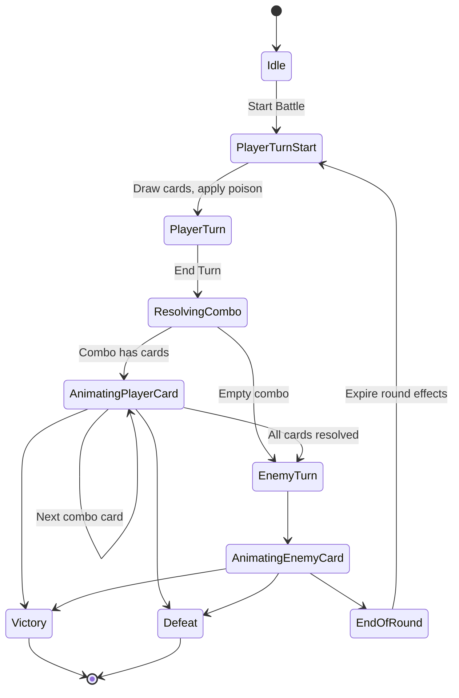

# Dark Fantasy Card Game — Mechanics

This document describes the game rules implemented today and the planned direction for the full game.

## Scope

**Implemented now:** turn-based card battles, Hollowfort exploration with a shared run, class XP unlocks, player level + choosable combat skills, and prison encounter pressure on cards and shields.

**Planned later:** money economy and further world content beyond the prison slice. See [Player Level and Combat Skills](#player-level-and-combat-skills) for the live progression model.

Battles are the combat layer of the larger run. Exploration carries hand, deck, discard, and shield into fights.

---

## Exploration Encounter Pressure

Each exploration turn draws up to **hand size (4)**. **Actions equal cards in hand** — spending a card for an action also spends that action. Encounters that discard or add hand cards change how many actions you have left. When the turn ends, leftover hand cards are kept, the next turn draws up to hand size again, then the **encounter deck** resolves on that hand.

Every action costs one card from hand. Choosing the action comes first: pressing an action such as **Travel here** with no card selected opens a card picker over a dimmed screen, showing the hand and what each card would do for that action. Picking a card spends it and resolves the action; cancelling returns to the map so another action can be chosen. If a card is already selected in the hand bar, the action resolves immediately with it.

Encounters can:

| Effect | Behavior |
|--------|----------|
| `discardCards` | Randomly discard cards from hand |
| `recoverDiscard` | Return cards from discard to hand |
| `shuffleCards` | Shuffle `hand`, `deck`, `discard`, or `all` piles |
| `addCards` | Inject card ids into hand / deck / discard |
| `modifyShield` | Change current shield (`value`) only; capped at `maxShield` |
| `modifyMana` | Change current mana (`value`) only; capped at `maxMana` |

Exploration tracks `shield` / `maxShield` and `mana` / `maxMana`. Caps come from **player skills** (defaults 2 / 2); raising a skill mid-run updates the live exploration caps. Shield and mana carry into location battles; after a **won** battle, both restore to their max. The encounter modal lists cards, shield, and mana deltas that changed.

---

## Core Concept: Health Is Your Deck

There are no separate hit points. **Remaining cards represent health.**

| Combatant | Health formula |
|-----------|----------------|
| Player | cards in **deck** + **hand** + **combo** |
| Enemy | cards in **deck** only |

When a combatant takes damage, they lose that many cards from their deck (or other zones for the player). When health reaches zero, that combatant loses the battle.

- **Player defeat:** no cards left in deck, hand, or combo.
- **Victory:** enemy deck is empty.

Max health is recorded at battle start from the initial deck size.

---

## Battle Flow

A battle is a repeating cycle of **player turn → combo resolution → enemy turn → end of round**.


```mermaid
stateDiagram-v2
  [*] --> Idle
  Idle --> PlayerTurnStart: Start Battle
  PlayerTurnStart --> PlayerTurn: Draw cards, apply poison
  PlayerTurn --> ResolvingCombo: End Turn
  ResolvingCombo --> AnimatingPlayerCard: Combo has cards
  ResolvingCombo --> EnemyTurn: Empty combo
  AnimatingPlayerCard --> AnimatingPlayerCard: Next combo card
  AnimatingPlayerCard --> EnemyTurn: All cards resolved
  AnimatingPlayerCard --> Victory
  AnimatingPlayerCard --> Defeat
  EnemyTurn --> AnimatingEnemyCard
  AnimatingEnemyCard --> EndOfRound
  AnimatingEnemyCard --> Victory
  AnimatingEnemyCard --> Defeat
  EndOfRound --> PlayerTurnStart: Expire round effects
  Victory --> [*]
  Defeat --> [*]
```

### Player turn start

At the beginning of each player turn:

1. **Poison ticks** on the player, then on the enemy (see [Poison](#poison)).
2. Victory/defeat is checked after poison.
3. **Cards are drawn:**
   - First turn of the battle: fill toward **hand size** (default **4**, constant — not a progression skill).
   - Every later turn: **draw per turn** cards (default **1** today; planned as a player skill).

The player deck does **not** reshuffle from discard when empty. If the deck is empty, no more cards are drawn.

### Player turn

During the player turn the player can:

- Move cards from **hand** into the **combo** (click a hand card).
- Move cards from **combo** back to **hand** (click a combo card).
- Review the **combo preview** (see [Combo Preview](#combo-preview)).
- Press **End Turn** to lock in the combo and begin resolution.

Today the combo is capped at **2** cards (`COMBO_CAP`). Planned: a **max combo** skill raises that ceiling.

### Combo resolution

When the player ends the turn:

1. Combo cards are queued and resolved **one at a time**, left to right (the order they were added).
2. Each card’s effects run against the current battle state.
3. After resolution, the card goes to the player **discard** pile.
4. Attack and defense cards increment battle-wide combat stats (used by some effect types).

Resolution is animated step by step. The player cannot act during resolution.

If the combo is empty, the turn ends immediately with no player card effects.

### Enemy turn

The enemy plays **one random card** from their deck:

1. A card is chosen uniformly at random from the enemy deck.
2. Its effects resolve (typically targeting the player).
3. The card moves to the enemy **discard** pile.

If the enemy deck is empty but discard is not, the enemy **reshuffles** discard into a new deck and then plays.

### End of round

After the enemy turn, temporary round effects expire:

- **Barrier** on the player is removed (unused barrier is lost).
- **Damage reduction** (`reduceDamagePercent`) is cleared.

Enemy barrier is **not** cleared here — it stays up for the next player combo, then expires when the enemy turn begins again.

Then the next player turn begins.

---

## Damage

Damage is a number of **cards to remove** from the target.

### Resolution order (player taking damage)

When the player is hit, defenses apply in this order:

1. **Damage reduction** (if active this round) — reduction amount is rounded **up** (`ceil`). Example: 3 damage at 50% reduction → 2 reduced, 1 taken.
2. **Barrier** — absorbs damage until depleted.
3. **Shield** — absorbs damage until depleted, unless the attack **ignores shield**.
4. **Card loss** — remaining damage removes cards.

### Card loss order (player)

Cards are removed in this order:

1. Deck (top/first card)
2. Hand
3. Combo

### Card loss (enemy)

Cards are removed randomly from the enemy deck.

### Ignoring shield

Some attacks set `ignoreShield` before dealing damage. Shield is skipped, but barrier and damage reduction still apply to the player.

---

## Shield

- **Persistent** until used or the battle ends.
- Both player and enemy can have shield.
- Default **maximum shield: 2** (today from battle setup; planned as the **Max shield** player skill).
- Gaining shield when already at max grants only enough to reach the cap; excess is wasted.

Shield blocks damage 1-for-1 before cards are lost. After a **won** location battle, current shield restores to max.

---

## Barrier

- Blocks damage like shield (1-for-1) and is applied **before** shield when that side is hit.
- **Player barrier** expires at end of round — unused barrier is lost after the enemy turn.
- **Enemy barrier** (from enemy cards or `barrierPerTurn`) lasts until after the next player combo (or skipped turn), then unused barrier expires before the enemy acts again.
- Does not have a separate cap beyond what cards / regenerating effects grant.

---

## Poison

Poison is a debuff with:

- `damagePerTurn` — cards lost each tick
- `remainingTurns` — how many ticks remain

### Application

Applying poison **replaces** any existing poison on that target (does not stack).

### Ticks

Poison damage is applied at **player turn start**, in order:

1. Player poison tick
2. Enemy poison tick

Poison **bypasses** shield, barrier, and damage reduction.

After each tick, remaining turns decrease by 1. At zero, poison is removed.

---

## Damage Reduction

Granted by defense cards such as Smoke Escape.

- Sets incoming damage reduction for the **rest of the current round** (until end of round).
- Only affects damage taken by the **player**.
- Percentage is applied before barrier and shield.
- Re-applying overwrites the previous value for that round.

---

## Cards

### Player cards

Player cards belong to a **class** and have a **type**:

| Class | Theme |
|-------|-------|
| Warrior | Direct damage and shield |
| Rogue | Poison and evasion |
| Wizard | Barrier, pierce, and battle mana (charge → spend) |
| Survivor | Conditional power and recovery |
| Seeker | Dig, mark, and exploit weak points |

| Type | Role |
|------|------|
| Attack | Effects target the **enemy** |
| Defense | Effects target the **player** |

Card data lives in `packages/content/src/playerCards.json`.

### Enemy cards

Enemy cards have no class/type in data. Effects are inferred at runtime for animations. All current enemy cards are attacks targeting the player.

Card data lives in `src/data/enemyCards.json`.

---

## Effect System

Each card has an ordered list of **effects** resolved top to bottom on the same card. Effect handlers are registered in `src/engine/effects/registry.ts`.

| Effect | Description |
|--------|-------------|
| `damage` | Deal `value` damage to the target. Adds any pending damage bonus, then clears it. |
| `shield` | Gain `value` shield on the source combatant. Adds pending shield bonus. Respects max shield. |
| `barrier` | Gain `value` barrier on the player. Adds pending barrier bonus. |
| `poison` | Apply poison: `damagePerTurn` for `duration` turns. |
| `ignoreShield` | Next `damage` on this card ignores shield. |
| `draw` | Draw `count` cards from deck to hand (no discard reshuffle). Cards whose effects are **only** `draw` play **instantly** (not into the combo, no combo-slot cost). |
| `recoverDiscard` | Move up to `count` cards from discard to hand (most recently discarded first). |
| `bonusDamagePerAttackCard` | Add `value` × (other Attack cards in **current combo**) to pending damage. Excludes the card being resolved. |
| `bonusBarrierPerDefenseCard` | Add `value` × (other Defense cards in **current combo**) to pending barrier. Excludes the card being resolved. |
| `bonusShieldPerDefenseCard` | Add `value` × (`defenseCardsPlayed` this battle) to pending shield. |
| `bonusIfLowerHp` | If player HP at combo commit is below `thresholdPercent` of max HP, add `damage` to pending damage (order-independent). |
| `bonusIfFirstAttack` | If no attack cards have resolved yet this battle at combo commit, add `damage` to pending damage. |
| `restoreMaxShields` | If shield is empty, restore it to max. |
| `reduceDamagePercent` | Set player damage reduction to `value`% for this round. |
| `gainMana` | Player only. Gain `value` mana, capped at `playerMaxMana` (default **2**). |
| `bonusDamagePerMana` | Add `value` × **current mana** to pending damage, then spend all mana (set to 0). |
| `bonusBarrierPerMana` | Add `value` × **current mana** to pending barrier, then spend all mana (set to 0). |
| `markEnemy` | Battle-scoped: mark the enemy for Seeker payoffs. |
| `bonusIfMarked` | If the enemy is marked, add `damage` to pending damage. |
| `ignoreShieldIfMarked` | If the enemy is marked, next `damage` on this card ignores shield. |
| `bonusDamagePerCardDrawn` | Add `value` × **cards drawn this battle** to pending damage. |

### Mana

Run-scoped resource for the player (like shield). Starts at **2 / 2** and carries into battle. Wizard cards either **gain** mana (`gainMana`) or **spend** it for power (`bonusDamagePerMana` / `bonusBarrierPerMana`). Spend effects use all current mana at once. Combo order matters: play Focus after spending to recharge in the same turn. After a **won** location battle, mana restores to max (same as shield). Exploration encounters can raise or lower current mana via `modifyMana`.

### Combo-scoped bonuses

These count other cards in the **committed combo** (snapshot at combo start), excluding the card being resolved. Order inside the combo does not change the total:

- `bonusDamagePerAttackCard`
- `bonusBarrierPerDefenseCard`

Example: Battle Momentum with one other Attack card in the combo (e.g. Poison Dagger) deals 2 + 1 = 3 damage whether Momentum is first or second.

Example: start a fight at 2 mana and play Arcane Bolt alone — it spends 2 mana for +2 damage (4 pierce total). After spending, Focus (+2 mana) refills the pool for the next spend.

### Conditional bonuses

**Last Stand** uses `bonusIfLowerHp`: if the player’s HP at **combo commit** (deck + hand + full combo, before any card resolves) is below `thresholdPercent` of starting max HP, it adds +2 damage before its damage effect (4 total instead of 2). The check is **order-independent** and must match the combo preview.

**Backstab** uses `bonusIfFirstAttack`: if **no attack cards have been played yet this battle** when the combo is committed, add bonus damage. Position inside the combo does not matter — the check uses attack count at combo start, so Backstab second in the first attack combo still gets the bonus. After any attack has resolved in a prior combo, later Backstabs do not.

---

## Player Card Reference

Each class has **6 cards** across base + improved (mix of attack and defense).

### Base

| Card | Class | Type | Effect |
|------|-------|------|--------|
| Heavy Strike | Warrior | Attack | 3 damage |
| Battle Momentum | Warrior | Attack | +1 damage per other Attack in combo; 2 damage |
| Raise Shield | Warrior | Defense | +2 shield |
| Poison Dagger | Rogue | Attack | Poison 1/turn for 3 turns |
| Backstab | Rogue | Attack | +2 damage if first attack combo of the battle; 2 damage |
| Smoke Escape | Rogue | Defense | 50% damage reduction this round |
| Arcane Bolt | Wizard | Attack | Ignore shield; 2 damage; +1 damage per mana spent |
| Magic Barrier | Wizard | Defense | +2 barrier; +1 barrier per mana spent |
| Focus | Wizard | Defense | +1 mana |
| Last Stand | Survivor | Attack | +2 damage if below 50% HP; 2 damage |
| Second Chance | Survivor | Defense | Recover 2 cards from discard |
| Survival Instinct | Survivor | Defense | Restore max shield if empty |
| Quick Survey | Seeker | Defense | Instant: draw 2 (no combo slot) |
| Mark the Joint | Seeker | Defense | Mark enemy; draw 1 |
| Weak-Point Strike | Seeker | Attack | 2 damage; if marked, pierce and +2 damage |

### Improved (unlocks)

| Card | Class | Type | Effect |
|------|-------|------|--------|
| Crushing Blow | Warrior | Attack | 4 damage |
| Warpath | Warrior | Defense | +2 shield; 25% damage reduction |
| Iron Wall | Warrior | Defense | +3 shield |
| Assassinate | Rogue | Attack | +2 if first attack combo; 3 damage |
| Venom Needle | Rogue | Defense | Poison 2×2; 25% damage reduction |
| Phantom Step | Rogue | Defense | 75% damage reduction |
| Arcane Lance | Wizard | Attack | Ignore shield; 3 damage; +2 damage per mana spent |
| Ward Lattice | Wizard | Defense | +3 barrier; +2 barrier per mana spent |
| Deep Focus | Wizard | Defense | +2 mana |
| Blood Fury | Survivor | Attack | +3 if below 50% HP; 3 damage |
| Second Wind | Survivor | Attack | Recover 2 from discard; 2 damage |
| Undying | Survivor | Defense | Restore max shield, then +1 shield |
| Deep Search | Seeker | Defense | Instant: draw 3 (no combo slot) |
| Anatomy Lesson | Seeker | Attack | 2 damage; +1 per card drawn this battle |
| Case Closed | Seeker | Attack | 3 damage; if marked, pierce and +3 damage |

## Enemy Groups and Power Bands

Enemy cards in `enemyCards.json` are split into **groups** so different opponents play differently, and gated by **band** so early fights stay simpler than late ones. Enemies themselves live in `enemies.json`.

| Group | Feel |
|-------|------|
| `warrior` | Shields and drilled strikes |
| `cutthroat` | Poison, pierce, fast cuts |
| `ritualist` | Barrier and shield bypass |
| `beast` | Raw damage and poison claws |
| `undead` | Grim defence, rot, remade guard |
| `brute` | Heavy trades, thick hide |

Every enemy is authored once in `enemies.json`, which holds both the band table and the roster. An entry carries its presentation (`name`, `tier`, `description`, `image`), its `band` and `group`, optional `signatureCardIds`, and optional stat overrides. Maps do not repeat any of that: a location lists **placements** — an enemy `id` plus placement-only rules such as `requiresFlag` and `skipAutoEncounter` — and run setup hydrates each placement into a live enemy. The same enemy can therefore be reused across locations and maps.

| Band | Deck size | Starting shield | Max shield | Barrier / turn |
|------|----------:|----------------:|-----------:|---------------:|
| `intro` | 8 | 0 | 1 | 0 |
| `common` | 12 | 2 | 2 | 0 |
| `elite` | 16 | 2 | 3 | 0 |
| `boss` | 22 | 3 | 4 | 1 |

The Hollowfort curve: `prisoner` and `giant_rat` are `intro`; `crazy_prisoner`, `guard`, and `fat_prisoner` are `common`; `butcher`, `knight`, and `demon` are `elite`; `sorcerer_enemy`, `inquisitor_boss`, `prison_warden_boss`, and `corrupted_anarchist` are `boss`.

Rules:

- A card's `minBand` is the weakest band allowed to draw it, so stronger cards appear only on stronger enemies.
- Explicit values on the enemy (`deckSize`, `startingShield`, `maxShield`, `barrierPerTurn`) always override band defaults.
- Cards marked `signature` are excluded from every normal pool and appear only when an enemy names them in `signatureCardIds` — used for route bosses. Listing an id more than once seeds that many copies into the deck.
- An unknown enemy id in a placement throws at run setup rather than failing silently.
- Enemy deck size **is** enemy health, so band deck size is also the HP dial.
- Enemy cards must not use `reduceDamagePercent`: that effect only reduces damage aimed at the player, so it would help the player instead.

---

## Combo Preview

During the player turn, a **Combo Preview** panel shows the expected outcome of the current combo before End Turn.

The preview simulates combo resolution on a copy of the battle state using the same effect handlers, so combo bonuses and conditional effects match actual resolution.

It can show:

- Damage to enemy (after enemy shield)
- Shield and barrier gained
- Poison applied
- Damage reduction for the round
- Cards recovered from discard
- Whether any card ignores shield

---

## Battle Configuration

Default setup is in `src/data/battle.json`:

| Setting | Default |
|---------|---------|
| Player starting shield | 2 |
| Player max shield | 2 |
| Player starting hand | 4 cards on first turn (world battles); location battles keep the current exploration hand |
| Player deck | World battles: loadout shuffled. Location battles: exploration deck + discard shuffled into the draw pile; exploration discard starts empty |
| Enemy name | Shadow Beast |
| Enemy deck | World battles: 12 cards from the shared pool. Location battles: resolved from the enemy's band and group |
| Enemy starting shield | 2 |
| Enemy max shield | 2 |
| Enemy deck | All enemy cards, shuffled |

---

## Piles and Zones

### Player

| Zone | Purpose |
|------|---------|
| Deck | Draw pile; cards here count as HP |
| Hand | Playable cards |
| Combo | Cards queued for this turn’s resolution |
| Discard | Resolved and lost cards; can be recovered by effects |

### Enemy

| Zone | Purpose |
|------|---------|
| Deck | Draw pile and HP |
| Discard | Played cards; reshuffled when deck is empty |

---

## Player Level and Combat Skills

Inspiration: Skyrim-style separation of **skills you use** (classes / cards) from **attributes you choose** when the character levels.

**Do not** hard-bind combat ceilings to classes. Classes earn XP and unlock cards; **player level** grants a free choice among shared combat skills.

```text
Play cards → class XP → class levels
                ↓
     every 5 class levels → +1 player level
                ↓
     choose one skill to raise (+1)
                ↓
     also: spend free class levels on improved cards (existing sink)
```

### Player level

| Idea | Rule |
|------|------|
| Source | Sum of class levels across all classes (Warrior + Rogue + Wizard + Survivor + Seeker) |
| Rate | **1 player level per 5 class levels** |
| On level-up | Player **chooses exactly one** skill to increase by 1 (Character screen) |
| Does not auto-raise | Skills never rise just from playing related cards — only from the level-up choice |

Class levels remain independent (10 XP = 1 class level). Spending a class level on an improved card does not spend the player-level skill point.

Unspent skill points are derived: `floor(totalClassLevels / 5) − sum(skill − base)`.

Example: 3 Warrior + 2 Rogue = 5 class levels → player level 1 → pick Max Combo or Max Shield, etc.

### Combat skills

Hand size stays a **constant** (default 4). It is not a skill.

| Skill | Role | Start | Soft ceiling (hard pick cap) | Notes |
|-------|------|------:|-----------------------------:|-------|
| **Max shield** | Guard capacity | 2 | 4 | Cards refill current guard up to this cap. |
| **Max combo** | Cards in combo at once | 2 | 5 | Used by battle combo slots. |
| **Max mana** | Cap for battle / exploration mana | 2 | 5 | See [Mana](#mana). |
| **Max deck** | Loadout / HP ceiling | 15 | 18 | Improved unlocks force a cut when the deck is full. |
| **Draw per turn** | Cards drawn at each player turn after the opening hand | 1 | 3 | Opening hand still fills to hand size (4). Seeker dig cards draw *extra*. |

### Mana

Battle mana is **implemented** (default max **2**, raised via the max mana skill). See [Mana](#mana) under Effect System.

- Mana is **run-scoped** like shield: starts full, carries into battle from exploration, restores to max after a won fight.
- Cards either **gain** mana or **spend** mana — wizard kit follows that split.
- Spend scales damage or barrier by mana spent (all current mana), shown in combo preview.
- Exploration encounters can change current mana via `modifyMana`.

### Seeker class

Fifth class: **information → precision**. Dig and mark, then strike the weak point.

**Implemented loop:** Mark the Joint → Weak-Point Strike / Case Closed. Dig with Quick Survey / Deep Search (**instant draw** — resolves immediately, does not use a combo slot); Anatomy Lesson scales with cards drawn this battle.

Peek/cancel enemy-intent cards remain planned.

### What stays class-owned

| Still class-owned | Still shared / choosable |
|-------------------|--------------------------|
| Card pools and improved unlocks | Max shield, max combo, max mana, max deck, draw per turn |
| Class XP from playing that class’s cards | Player level from total class levels |
| Portrait / dominant-deck flavor | Skill picks at player level-up |

### Fiction note (shield vs armor)

If inventory armor appears later: treat **max shield** as how well you can brace (skill + kit capacity), and **current shield** as guard right now. Cards that grant shield are raising guard, not conjuring metal — armor items raise the ceiling; cards refill within it. Barrier remains the “ward that appears and expires” layer.

### Open balance knobs

- Exact ratio: class levels → player level (5:1 now).
- Whether enemy bands / world threats ever scale with **player level**. Prefer **not** for Hollowfort Beta — keep enemy difficulty map-authored.
- Whether items can raise skills temporarily vs permanently.

---

## Planned Game Loop (Not Implemented)

The full game extends the Hollowfort run into the wider map:

1. **Global map** — move between locations; choose routes.
2. **Encounters** — events, shops, battles (enemy identity from content / `enemies.json`).
3. **Class XP + player level** — cards unlock from class levels; combat skills rise from player-level choices (live in the prison slice).
4. **Deck building** — assemble a personal deck under the live **max deck** skill; mid-run unlocks rebuild the exploration deck.

Battles in this document are the combat resolution for that loop.

---

## Technical Notes

- Battle state is managed by an XState machine (`src/machine/battleMachine.ts`).
- Battle logic is pure functions over `BattleContext` (`src/types/battle.ts`).
- Card definitions are JSON; effects are data-driven and extensible via the effect registry.
