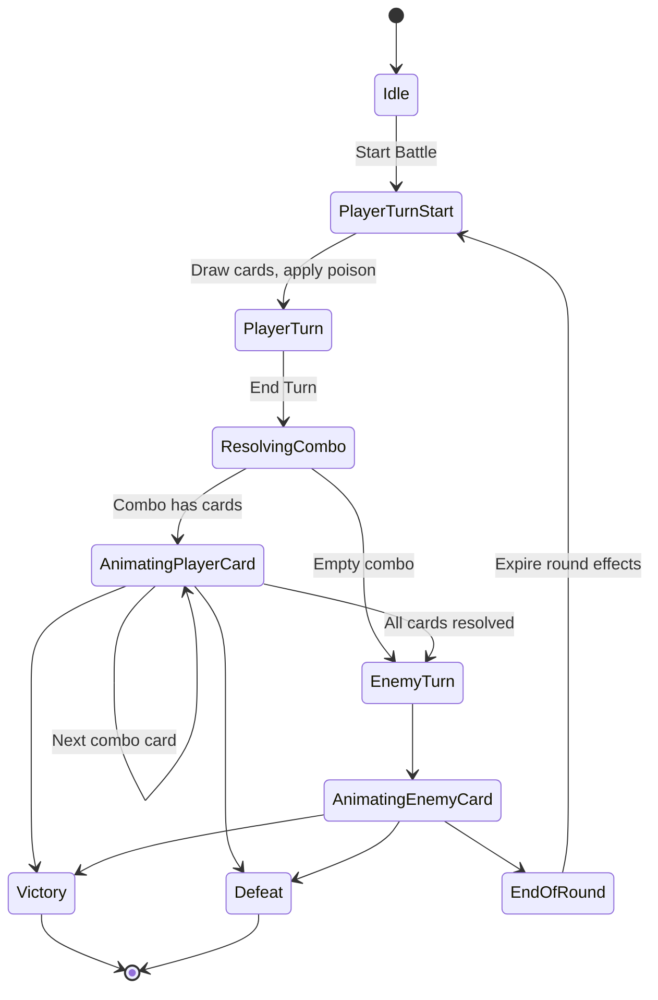

# Dark Fantasy Card Game — Mechanics

This document describes the game rules implemented today and the planned direction for the full game.

## Scope

**Implemented now:** turn-based card battles, Hollowfort exploration with a shared run, class XP unlocks, and prison encounter pressure on cards and shields.

**Planned later:** player level + choosable combat skills (max shield, combo size, mana, deck cap, draw per turn), Seeker class, mana on wizard cards, money economy, and further world content beyond the prison slice. See [Planned Progression](#planned-progression-not-implemented).

Battles are the combat layer of the larger run. Exploration carries hand, deck, discard, and shield into fights.

---

## Exploration Encounter Pressure

Each exploration turn grants **4 actions**. Spending a card or ending the turn spends actions. When the turn ends, the next turn **keeps leftover hand cards**, **draws up to hand size (4)**, then the **encounter deck** resolves on that hand.

Every action costs one card from hand. Choosing the action comes first: pressing an action such as **Travel here** with no card selected opens a card picker over a dimmed screen, showing the hand and what each card would do for that action. Picking a card spends it and resolves the action; cancelling returns to the map so another action can be chosen. If a card is already selected in the hand bar, the action resolves immediately with it.

Encounters can:

| Effect | Behavior |
|--------|----------|
| `discardCards` | Randomly discard cards from hand |
| `recoverDiscard` | Return cards from discard to hand |
| `shuffleCards` | Shuffle `hand`, `deck`, `discard`, or `all` piles |
| `addCards` | Inject card ids into hand / deck / discard |
| `modifyShield` | Change current shield (`value`) only; capped at `maxShield` |

Exploration tracks `shield` / `maxShield`. Current shield can change during exploration; today `maxShield` is fixed from content defaults. Planned: `maxShield` becomes a **player skill** chosen at player level-up (see [Planned Progression](#planned-progression-not-implemented)). Shield carries into location battles; after a **won** battle, current shield restores to `maxShield`. The encounter modal lists cards and shield deltas that changed.

---

## Core Concept: Health Is Your Deck

There are no separate hit points. **Remaining cards represent health.**

| Combatant | Health formula |
|-----------|----------------|
| Player | cards in **deck** + **hand** + **combo** |
| Enemy | cards in **deck** only |

When a combatant takes damage, they lose that many cards from their deck (or other zones for the player). When health reaches zero, that combatant loses the battle.

- **Player defeat:** no cards left in deck, hand, or combo.
- **Victory:** enemy deck is empty.

Max health is recorded at battle start from the initial deck size.

---

## Battle Flow

A battle is a repeating cycle of **player turn → combo resolution → enemy turn → end of round**.


```mermaid
stateDiagram-v2
  [*] --> Idle
  Idle --> PlayerTurnStart: Start Battle
  PlayerTurnStart --> PlayerTurn: Draw cards, apply poison
  PlayerTurn --> ResolvingCombo: End Turn
  ResolvingCombo --> AnimatingPlayerCard: Combo has cards
  ResolvingCombo --> EnemyTurn: Empty combo
  AnimatingPlayerCard --> AnimatingPlayerCard: Next combo card
  AnimatingPlayerCard --> EnemyTurn: All cards resolved
  AnimatingPlayerCard --> Victory
  AnimatingPlayerCard --> Defeat
  EnemyTurn --> AnimatingEnemyCard
  AnimatingEnemyCard --> EndOfRound
  AnimatingEnemyCard --> Victory
  AnimatingEnemyCard --> Defeat
  EndOfRound --> PlayerTurnStart: Expire round effects
  Victory --> [*]
  Defeat --> [*]
```

### Player turn start

At the beginning of each player turn:

1. **Poison ticks** on the player, then on the enemy (see [Poison](#poison)).
2. Victory/defeat is checked after poison.
3. **Cards are drawn:**
   - First turn of the battle: fill toward **hand size** (default **4**, constant — not a progression skill).
   - Every later turn: **draw per turn** cards (default **1** today; planned as a player skill).

The player deck does **not** reshuffle from discard when empty. If the deck is empty, no more cards are drawn.

### Player turn

During the player turn the player can:

- Move cards from **hand** into the **combo** (click a hand card).
- Move cards from **combo** back to **hand** (click a combo card).
- Review the **combo preview** (see [Combo Preview](#combo-preview)).
- Press **End Turn** to lock in the combo and begin resolution.

Today there is no limit on combo size beyond how many cards are in hand. Planned: a **max combo** skill caps how many cards may sit in the combo at once.

### Combo resolution

When the player ends the turn:

1. Combo cards are queued and resolved **one at a time**, left to right (the order they were added).
2. Each card’s effects run against the current battle state.
3. After resolution, the card goes to the player **discard** pile.
4. Attack and defense cards increment battle-wide combat stats (used by some effect types).

Resolution is animated step by step. The player cannot act during resolution.

If the combo is empty, the turn ends immediately with no player card effects.

### Enemy turn

The enemy plays **one random card** from their deck:

1. A card is chosen uniformly at random from the enemy deck.
2. Its effects resolve (typically targeting the player).
3. The card moves to the enemy **discard** pile.

If the enemy deck is empty but discard is not, the enemy **reshuffles** discard into a new deck and then plays.

### End of round

After the enemy turn, temporary round effects expire:

- **Barrier** on the player is removed (unused barrier is lost).
- **Damage reduction** (`reduceDamagePercent`) is cleared.

Then the next player turn begins.

---

## Damage

Damage is a number of **cards to remove** from the target.

### Resolution order (player taking damage)

When the player is hit, defenses apply in this order:

1. **Damage reduction** (if active this round) — reduction amount is rounded **up** (`ceil`). Example: 3 damage at 50% reduction → 2 reduced, 1 taken.
2. **Barrier** (player only) — absorbs damage until depleted.
3. **Shield** — absorbs damage until depleted, unless the attack **ignores shield**.
4. **Card loss** — remaining damage removes cards.

### Card loss order (player)

Cards are removed in this order:

1. Deck (top/first card)
2. Hand
3. Combo

### Card loss (enemy)

Cards are removed randomly from the enemy deck.

### Ignoring shield

Some attacks set `ignoreShield` before dealing damage. Shield is skipped, but barrier and damage reduction still apply to the player.

---

## Shield

- **Persistent** until used or the battle ends.
- Both player and enemy can have shield.
- Default **maximum shield: 2** (today from battle setup; planned as the **Max shield** player skill).
- Gaining shield when already at max grants only enough to reach the cap; excess is wasted.

Shield blocks damage 1-for-1 before cards are lost. After a **won** location battle, current shield restores to max.

---

## Barrier

- **Player only.**
- Blocks damage like shield (1-for-1) but is applied **before** shield when the player is hit.
- **Expires at end of round** — all unused barrier is lost.
- Does not have a separate cap beyond what cards grant.

---

## Poison

Poison is a debuff with:

- `damagePerTurn` — cards lost each tick
- `remainingTurns` — how many ticks remain

### Application

Applying poison **replaces** any existing poison on that target (does not stack).

### Ticks

Poison damage is applied at **player turn start**, in order:

1. Player poison tick
2. Enemy poison tick

Poison **bypasses** shield, barrier, and damage reduction.

After each tick, remaining turns decrease by 1. At zero, poison is removed.

---

## Damage Reduction

Granted by defense cards such as Smoke Escape.

- Sets incoming damage reduction for the **rest of the current round** (until end of round).
- Only affects damage taken by the **player**.
- Percentage is applied before barrier and shield.
- Re-applying overwrites the previous value for that round.

---

## Cards

### Player cards

Player cards belong to a **class** and have a **type**:

| Class | Theme |
|-------|-------|
| Fighter | Direct damage and shield |
| Rogue | Poison and evasion |
| Wizard | Barrier and shield bypass (planned: mana charge / spend) |
| Survivor | Conditional power and recovery |
| Seeker | Planned fifth class — dig, mark, deduce; mono-viable with smart attacks |

| Type | Role |
|------|------|
| Attack | Effects target the **enemy** |
| Defense | Effects target the **player** |

Card data lives in `src/data/playerCards.json`.

### Enemy cards

Enemy cards have no class/type in data. Effects are inferred at runtime for animations. All current enemy cards are attacks targeting the player.

Card data lives in `src/data/enemyCards.json`.

---

## Effect System

Each card has an ordered list of **effects** resolved top to bottom on the same card. Effect handlers are registered in `src/engine/effects/registry.ts`.

| Effect | Description |
|--------|-------------|
| `damage` | Deal `value` damage to the target. Adds any pending damage bonus, then clears it. |
| `shield` | Gain `value` shield on the source combatant. Adds pending shield bonus. Respects max shield. |
| `barrier` | Gain `value` barrier on the player. Adds pending barrier bonus. |
| `poison` | Apply poison: `damagePerTurn` for `duration` turns. |
| `ignoreShield` | Next `damage` on this card ignores shield. |
| `draw` | Draw `count` cards from deck to hand (no discard reshuffle). |
| `recoverDiscard` | Move up to `count` cards from discard to hand (most recently discarded first). |
| `bonusDamagePerAttackCard` | Add `value` × (other Attack cards in **current combo**) to pending damage. Excludes the card being resolved. |
| `bonusBarrierPerDefenseCard` | Add `value` × (other Defense cards in **current combo**) to pending barrier. Excludes the card being resolved. |
| `bonusShieldPerDefenseCard` | Add `value` × (`defenseCardsPlayed` this battle) to pending shield. |
| `bonusIfLowerHp` | If player HP at combo commit is below `thresholdPercent` of max HP, add `damage` to pending damage (order-independent). |
| `reduceDamagePercent` | Set player damage reduction to `value`% for this round. |

### Combo-scoped bonuses

These count other cards in the **committed combo** (snapshot at combo start), excluding the card being resolved. Order inside the combo does not change the total:

- `bonusDamagePerAttackCard`
- `bonusBarrierPerDefenseCard`

Example: Battle Momentum with one other Attack card in the combo (e.g. Poison Dagger) deals 2 + 1 = 3 damage whether Momentum is first or second.

Example: Barrier Mastery with one other Defense card in the combo grants 2 + 1 = 3 barrier.

### Conditional bonuses

**Last Stand** uses `bonusIfLowerHp`: if the player’s HP at **combo commit** (deck + hand + full combo, before any card resolves) is below `thresholdPercent` of starting max HP, it adds +2 damage before its damage effect (4 total instead of 2). The check is **order-independent** and must match the combo preview.

**Backstab** uses `bonusIfFirstAttack`: if **no attack cards have been played yet this battle** when the combo is committed, add bonus damage. Position inside the combo does not matter — the check uses attack count at combo start, so Backstab second in the first attack combo still gets the bonus. After any attack has resolved in a prior combo, later Backstabs do not.

---

## Player Card Reference

Each class has **3 attack + 3 defense** across base + improved cards.

### Base

| Card | Class | Type | Effect |
|------|-------|------|--------|
| Heavy Strike | Fighter | Attack | 3 damage |
| Battle Momentum | Fighter | Attack | +1 damage per other Attack in combo; 2 damage |
| Raise Shield | Fighter | Defense | +2 shield |
| Poison Dagger | Rogue | Attack | Poison 1/turn for 3 turns |
| Backstab | Rogue | Attack | +2 damage if first attack combo of the battle; 2 damage |
| Smoke Escape | Rogue | Defense | 50% damage reduction this round |
| Arcane Bolt | Wizard | Attack | Ignores shield; 2 damage |
| Magic Barrier | Wizard | Defense | +3 barrier |
| Barrier Mastery | Wizard | Defense | +1 barrier per other Defense in combo; +2 barrier |
| Last Stand | Survivor | Attack | +2 damage if below 50% HP; 2 damage |
| Second Chance | Survivor | Defense | Recover 2 cards from discard |
| Survival Instinct | Survivor | Defense | Restore max shield if empty |

### Improved (unlocks)

| Card | Class | Type | Effect |
|------|-------|------|--------|
| Crushing Blow | Fighter | Attack | 4 damage |
| Warpath | Fighter | Defense | +2 shield; 25% damage reduction |
| Iron Wall | Fighter | Defense | +3 shield |
| Assassinate | Rogue | Attack | +2 if first attack combo; 3 damage |
| Venom Needle | Rogue | Defense | Poison 2×2; 25% damage reduction |
| Phantom Step | Rogue | Defense | 75% damage reduction |
| Arcane Lance | Wizard | Attack | Ignore shield; 3 damage |
| Cascade Bolt | Wizard | Attack | +1 per other Attack in combo; 2 damage |
| Ward Lattice | Wizard | Defense | +4 barrier |
| Blood Fury | Survivor | Attack | +3 if below 50% HP; 3 damage |
| Second Wind | Survivor | Attack | Recover 2 from discard; 2 damage |
| Undying | Survivor | Defense | Restore max shield, then +1 shield |

## Enemy Groups and Power Bands

Enemy cards in `enemyCards.json` are split into **groups** so different opponents play differently, and gated by **band** so early fights stay simpler than late ones. Enemies themselves live in `enemies.json`.

| Group | Feel |
|-------|------|
| `warrior` | Shields and drilled strikes |
| `cutthroat` | Poison, pierce, fast cuts |
| `ritualist` | Barrier and shield bypass |
| `beast` | Raw damage and poison claws |
| `undead` | Grim defence, rot, remade guard |
| `brute` | Heavy trades, thick hide |

Every enemy is authored once in `enemies.json`, which holds both the band table and the roster. An entry carries its presentation (`name`, `tier`, `description`, `image`), its `band` and `group`, optional `signatureCardIds`, and optional stat overrides. Maps do not repeat any of that: a location lists **placements** — an enemy `id` plus placement-only rules such as `requiresFlag` and `skipAutoEncounter` — and run setup hydrates each placement into a live enemy. The same enemy can therefore be reused across locations and maps.

| Band | Deck size | Starting shield | Max shield | Barrier / turn |
|------|----------:|----------------:|-----------:|---------------:|
| `intro` | 8 | 0 | 1 | 0 |
| `common` | 12 | 2 | 2 | 0 |
| `elite` | 16 | 2 | 3 | 0 |
| `boss` | 22 | 3 | 4 | 1 |

The Hollowfort curve: `prisoner` and `giant_rat` are `intro`; `crazy_prisoner`, `guard`, and `fat_prisoner` are `common`; `butcher`, `knight`, and `demon` are `elite`; `sorcerer_enemy`, `inquisitor_boss`, `prison_warden_boss`, and `corrupted_anarchist` are `boss`.

Rules:

- A card's `minBand` is the weakest band allowed to draw it, so stronger cards appear only on stronger enemies.
- Explicit values on the enemy (`deckSize`, `startingShield`, `maxShield`, `barrierPerTurn`) always override band defaults.
- Cards marked `signature` are excluded from every normal pool and appear only when an enemy names them in `signatureCardIds` — used for route bosses. Listing an id more than once seeds that many copies into the deck.
- An unknown enemy id in a placement throws at run setup rather than failing silently.
- Enemy deck size **is** enemy health, so band deck size is also the HP dial.
- Enemy cards must not use `reduceDamagePercent`: that effect only reduces damage aimed at the player, so it would help the player instead.

---

## Combo Preview

During the player turn, a **Combo Preview** panel shows the expected outcome of the current combo before End Turn.

The preview simulates combo resolution on a copy of the battle state using the same effect handlers, so combo bonuses and conditional effects match actual resolution.

It can show:

- Damage to enemy (after enemy shield)
- Shield and barrier gained
- Poison applied
- Damage reduction for the round
- Cards recovered from discard
- Whether any card ignores shield

---

## Battle Configuration

Default setup is in `src/data/battle.json`:

| Setting | Default |
|---------|---------|
| Player starting shield | 2 |
| Player max shield | 2 |
| Player starting hand | 4 cards on first turn (world battles); location battles keep the current exploration hand |
| Player deck | World battles: loadout shuffled. Location battles: exploration deck + discard shuffled into the draw pile; exploration discard starts empty |
| Enemy name | Shadow Beast |
| Enemy deck | World battles: 12 cards from the shared pool. Location battles: resolved from the enemy's band and group |
| Enemy starting shield | 2 |
| Enemy max shield | 2 |
| Enemy deck | All enemy cards, shuffled |

---

## Piles and Zones

### Player

| Zone | Purpose |
|------|---------|
| Deck | Draw pile; cards here count as HP |
| Hand | Playable cards |
| Combo | Cards queued for this turn’s resolution |
| Discard | Resolved and lost cards; can be recovered by effects |

### Enemy

| Zone | Purpose |
|------|---------|
| Deck | Draw pile and HP |
| Discard | Played cards; reshuffled when deck is empty |

---

## Planned Progression (Not Implemented)

Inspiration: Skyrim-style separation of **skills you use** (classes / cards) from **attributes you choose** when the character levels. How you level matters — not only how high the number is.

### Design rule

**Do not** hard-bind combat ceilings to classes (e.g. Fighter always raises max shield). Classes earn XP and unlock cards; **player level** grants a free choice among shared combat skills. A pure Wizard build can still invest in max shield; a Fighter can still raise mana if they splash wizard cards.

```text
Play cards → class XP → class levels
                ↓
     every N class levels (proposed: 5) → +1 player level
                ↓
     choose one skill to raise (+1)
                ↓
     also: spend free class levels on improved cards (existing sink)
```

### Player level

| Idea | Proposal |
|------|----------|
| Source | Sum of class levels across all classes (Fighter + Rogue + Wizard + Survivor [+ Seeker]) |
| Rate | **1 player level per 5 class levels** (tunable; start here) |
| On level-up | Player **chooses exactly one** skill to increase by 1 |
| Does not auto-raise | Skills never rise just from playing related cards — only from the level-up choice (plus optional gear / items later) |

Class levels remain independent (10 XP = 1 class level). Spending a class level on an improved card still costs that class’s free levels; it does not spend the player-level skill point.

Example: 3 Fighter + 2 Rogue = 5 class levels → player level 1 → pick Max Combo or Max Shield, etc.

### Combat skills (choosable attributes)

Hand size stays a **constant** (default 4). It is not a skill. Everything below is a skill the player may raise at player level-up.

| Skill | Role | Proposed start | Soft ceiling (tunable) | Notes |
|-------|------|---------------:|-----------------------:|-------|
| **Max shield** | Guard capacity (armor ceiling) | 2 | 4 | Cards that grant shield still refill *current* guard up to this cap. Inventory armor (later) may help within or toward this cap — not a second uncapped stack. |
| **Max combo** | Cards allowed in the combo at once | 2 | 5 | Today unlimited (hand-limited). A low default makes combo-bonus cards aspirational; Rogue-heavy play still benefits but anyone can buy the skill. |
| **Max mana** | Cap for battle mana | 2 | 5 | New resource; see [Mana](#mana-planned). |
| **Max deck** | Loadout / HP ceiling | ~12–14 | ~18–20 | Deck size is HP *and* consistency. Raising the cap is room to specialize, not free bulk — UI should still encourage cutting weak cards. Today `DECK_CAP` 30 never binds. |
| **Draw per turn** | Cards drawn at the start of each player turn after the opening hand | 1 | 3 | Opening hand still fills to hand size (4). Seeker cards may draw *extra* beyond this baseline. |

Suggested early defaults if shipping a first pass: combo max **2**, draw **1**, shield **2**, mana **0/2**, deck cap tight enough that improved unlocks force a cut.

### Mana (planned)

Wizard identity shifts from “barrier + pierce only” to a **charge → spend** loop.

Rules (keep brutal-simple for Beta):

- Mana is **battle-scoped**: starts at 0 (or a small carry-in later), capped by **Max mana**, discarded or reset when the battle ends.
- Cards either **gain** mana or **spend** mana — avoid cards that do both in one effect list.
- Spend scales one clear number (damage *or* barrier), shown in combo preview.
- Cap stays small (pips, not a second HP bar).

Example card roles:

| Role | Behavior |
|------|----------|
| Channel / Focus | `+1 mana` (often defense / ritual) |
| Arcane Bolt (updated) | Base effect weak or pierce; spend 1–N mana to raise damage |
| Magic Barrier (updated) | Base barrier; spend mana to raise barrier |

Existing combo-barrier cards can stay; mana is an additional lever, not a replacement for barrier as a defense type.

### Seeker class (planned)

Fifth class: **information → precision**. Dig and read the fight, then strike the weak point. Not a tutor splash that other decks require — a full mono-class identity.

| | |
|-------|--------------------------------|
| Fantasy | Scout, archivist, restless prisoner who maps every corridor and every tell |
| Contrast with Rogue | Rogue is *opportunism* (timing, poison, first strike). Seeker is *preparation* (mark, peek, dig, then exploit) |
| Mono-class rule | A pure Seeker deck must win common fights alone. Roughly **half dig/setup, half payoff** (attacks + survival) — not a draw-only kit |
| Skill synergy | Benefits from **Draw per turn** and a usable **Max deck**, but does not own those skills |

#### Core loops

**1. Expose / Mark, then Exploit**

1. Play a setup card that **marks** the enemy (battle-scoped flag / counter).
2. Dig or hold until the payoff is in hand.
3. Play an exploit attack: bonus damage and/or **ignore shield** *while marked*.

Fiction: you found the gap in the guard; the next blow goes there.

**2. Deduce the next blow**

1. Peek or reveal the enemy’s next **1–N** deck cards (intent / telegraph).
2. Act on that knowledge: cancel or blunt a known attack, strike harder, or rearrange your own line.

Fiction: you already know what they will try.

#### Card directions (content sketch — not final names)

**Dig & search**

| Idea | Behavior |
|------|----------|
| Quick survey | Draw X cards (respect hand size) |
| Deep search | Draw until hand is full |
| Named find | Search own deck for a specific card (by id, type, or class); put it into hand |
| Recase | Put 1 card from discard on top of deck (or into hand) |
| Peek own line | Look at top N of own deck; leave one, bury the rest |

**Deduction & enemy knowledge**

| Idea | Behavior |
|------|----------|
| Read the tell | See the enemy’s next **1–N** cards |
| Deduce the next blow | Defense: peek enemy top card(s); gain small guard/barrier *or* prepare a cancel |
| Cancel known strike | If you know the enemy’s next card (peeked this battle / this turn), **negate or skip** that enemy play when it would resolve |
| Case notes | Keep “known” enemy cards visible until they are played or the battle ends |

**Payoff attacks (smart damage — required for mono)**

| Idea | Behavior |
|------|----------|
| Weak-point strike | Modest base damage; **ignore shield** and/or bonus damage if the enemy is **marked** |
| Anatomy lesson | Damage **+1 per card drawn this turn** (or this battle) |
| Prepared thrust | Bonus damage if you peeked the enemy this turn, or if a dig card is also in the combo |
| Case closed (improved) | Large hit that requires a condition a pure Seeker deck can set reliably (marked, or N cards drawn, or known enemy card) |

Avoid raw “deal 4 with no condition” (that is Fighter) and avoid `bonusIfFirstAttack` as the main identity (that is Rogue).

**Survival / setup defenses**

| Idea | Behavior |
|------|----------|
| Keep your distance | Small shield or damage reduction after a peek/draw |
| Mark the joint | Mark enemy; optionally draw 1 |
| Sidestep the obvious | If next enemy card is known, reduce its damage to 0 or prevent that one card |

#### Effects the engine will need (beyond today)

Existing verbs already cover part of the kit: `draw`, `recoverDiscard`, `ignoreShield`, conditional damage bonuses.

Likely **new** effect / state pieces:

| Piece | Purpose |
|-------|---------|
| `markEnemy` / `requireMarked` | Expose → Exploit loop |
| `peekEnemyDeck` (count) | Deduce the next blow |
| `knownEnemyCards` (battle memory) | Cancel / bonus while knowledge lasts |
| `cancelNextEnemyCard` or skip one enemy play | Payoff for correct deduction |
| `bonusDamagePerCardDrawn` | Scale with dig this turn/battle |
| `searchDeck` (filter: type / class / id) | Named find — needs a small pick UI |

Combo preview should show mark status, known enemy cards, and draw-scaled damage the same way it shows other conditionals today.

#### Authoring checklist

Before shipping Seeker cards, a pure Seeker hand should answer in one sentence: **how do I win this knight fight?** If the answer is only “draw more,” the class is not ready.

Prefer shipping the **player-level + skills** frame with the current four classes first; add Seeker when mark/peek/cancel feel good in battle UI.

### What stays class-owned

| Still class-owned | Still shared / choosable |
|-------------------|--------------------------|
| Card pools and improved unlocks | Max shield, max combo, max mana, max deck, draw per turn |
| Class XP from playing that class’s cards | Player level from total class levels |
| Portrait / dominant-deck flavor | Skill picks at player level-up |

### Fiction note (shield vs armor)

If inventory armor appears later: treat **max shield** as how well you can brace (skill + kit capacity), and **current shield** as guard right now. Cards that grant shield are raising guard, not conjuring metal — armor items raise the ceiling; cards refill within it. Barrier remains the “ward that appears and expires” layer.

### Open balance knobs

- Exact ratio: class levels → player level (5:1 is a starting guess).
- Whether enemy bands / world threats ever scale with **player level** (Skyrim-like risk: high level, weak combat picks). Prefer **not** for Hollowfort Beta — keep enemy difficulty map-authored.
- Whether items can raise skills temporarily vs permanently.
- Soft ceilings per skill so one dump-stat does not trivialize intro bands.

---

## Planned Game Loop (Not Implemented)

The full game extends the Hollowfort run into the wider map:

1. **Global map** — move between locations; choose routes.
2. **Encounters** — events, shops, battles (enemy identity from content / `enemies.json`).
3. **Class XP + player level** — cards unlock from class levels; combat skills rise from player-level choices.
4. **Deck building** — assemble a personal deck under the live **max deck** skill; mid-run unlocks rebuild the exploration deck.

Battles in this document are the combat resolution for that loop.

---

## Technical Notes

- Battle state is managed by an XState machine (`src/machine/battleMachine.ts`).
- Battle logic is pure functions over `BattleContext` (`src/types/battle.ts`).
- Card definitions are JSON; effects are data-driven and extensible via the effect registry.
